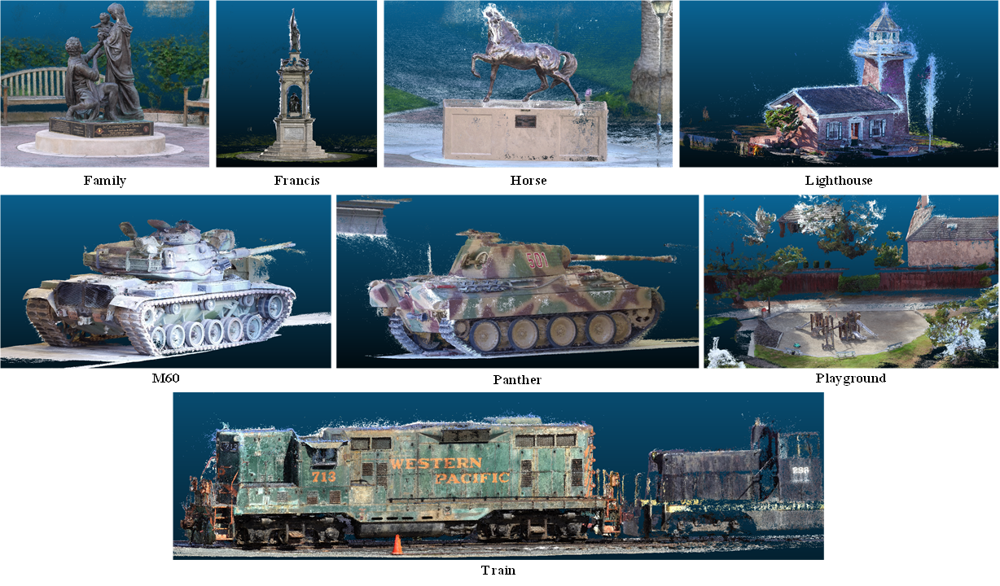
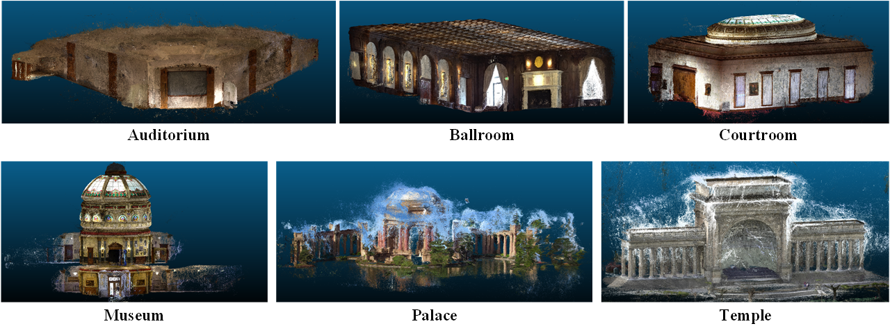

# MVOCO-MVSNet and MVOCO-MVSNet+

Details are described in our paper:
> Observation-Consistent Optimization: A New Paradigm for Supervised Multi-View Stereo Reconstruction
>
> Liangliang Li, Guihua Liu, Feng Xu

Observation Consistency Optimization (OCO) framework is a novel supervision paradigm grounded in state estimation theory, which significantly enhances the model's semantic understanding of scenes by establishing bidirectional consistency constraints between image feature space and depth space. Additionally, to further strengthen the model's spatial perception capabilities, we designing a Differentiable Spatial Encoding (DSE) module.

<strong>🚀 Coming soon!</strong>

## 💡 Results

Our results on DTU and Tanks and Temples Dataset are listed in the tables.

| DTU Dataset | Acc. ↓ | Comp. ↓ | Overall ↓ |
| ----------- | ------ | ------- | --------- |
| MVOCO-MVSNet  | 0.344  |  0.243  |   0.294   |
| MVOCO-MVSNet+ | 0.337  |  0.241  |   0.289   |

| T&T (Intermediate)| Mean ↑ | Family | Francis | Horse | Lighthouse | M60   | Panther | Playground | Train |
| ------------------| ------ | ------ | ------- | ----- | ---------- | ----- | ------- | ---------- | ----- |
| MVOCO-MVSNet+       | 65.30  | 82.29  | 68.37   | 55.61 |    67.34   | 64.03 |  63.47  |    61.52   | 59.78 |

| T&T (Advanced) | Mean ↑ | Auditorium | Ballroom | Courtroom | Museum | Palace | Temple |
| -------------- | ------ | ---------- | -------- | --------- | ------ | ------ | ------ |
| MVOCO-MVSNet+    | 41.84  | 30.96      | 46.02    | 40.30     | 51.98  | 35.97  | 45.80  |

## Visualization Results on the Tanks and Temples Dataset

### Qualitative Results on Intermediate Set

  
   
  <em>Figure 1: MVOCO-MVSNet+ reconstruction results on the Intermediate Set of Tanks and Temples.</em>

### Qualitative Results on Advanced Set

  
   
  <em>Figure 2: MVOCO-MVSNet+ reconstruction results on the Advanced set of Tanks and Temples.</em>

## 👩‍ Acknowledgements

Thanks to [MVSNet](https://github.com/YoYo000/MVSNet), [MVSNet_pytorch](https://github.com/xy-guo/MVSNet_pytorch), [CasMVSNet](https://github.com/alibaba/cascade-stereo/tree/master/CasMVSNet), [GeoMVSNet](https://github.com/doubleZ0108/GeoMVSNet), [ET-MVSNet](https://github.com/TQTQliu/ET-MVSNet), and [CL-MVSNet](https://KaiqiangXiong.github.io/CL-MVSNet)
