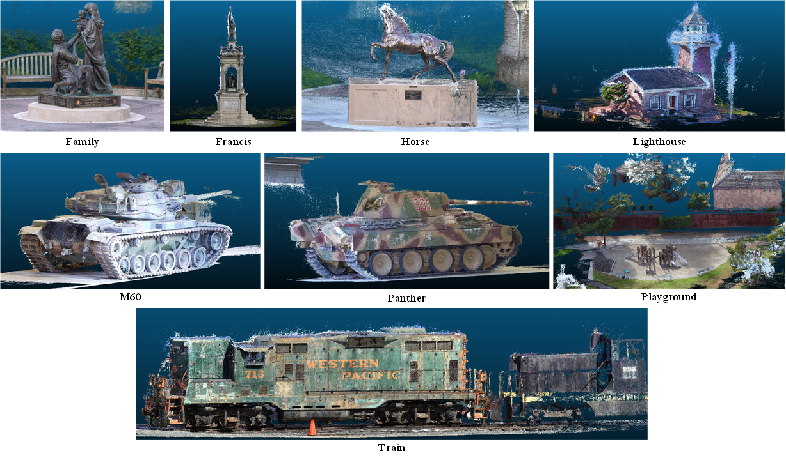
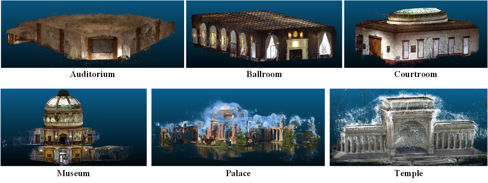

# MVOCO-MVSNet and MVOCO-MVSNet+

Details are described in our paper:
> Explicit Modeling of Multi-View Observation Consistency for Supervised Multi-View Stereo
>
> Liangliang Li, Guihua Liu, Feng Xu

Observation Consistency Optimization (OCO) framework is a novel supervision paradigm grounded in state estimation theory, which significantly enhances the model's semantic understanding of scenes by establishing bidirectional consistency constraints between image feature space and depth space. Additionally, to further strengthen the model's spatial perception capabilities, we designing a Differentiable Spatial Encoding (DSE) module.

## 🔨 Setup

### 1.1 Requirements

Use the following commands to build the `conda` environment.

```bash
conda create -n geomvsnet python=3.8
conda activate geomvsnet
pip install -r requirements.txt
```

### 1.2 Datasets

Download the following datasets and modify the corresponding local path in `scripts/data_path.sh`.

#### DTU Dataset

**Training data**. We use the same DTU training data as mentioned in MVSNet and CasMVSNet, please refer to [DTU training data](https://drive.google.com/file/d/1eDjh-_bxKKnEuz5h-HXS7EDJn59clx6V/view) and [Depth raw](https://virutalbuy-public.oss-cn-hangzhou.aliyuncs.com/share/cascade-stereo/CasMVSNet/dtu_data/dtu_train_hr/Depths_raw.zip) for data download. Optional, you should download the [Recitfied raw](http://roboimagedata2.compute.dtu.dk/data/MVS/Rectified.zip) if you want to train the model in raw image resolution. Unzip and organize them as:

```
dtu/
├── Cameras
├── Depths
├── Depths_raw
├── Rectified
└── Rectified_raw (optional)
```

**Testing data**. For convenience, we use the [DTU testing data](https://drive.google.com/file/d/1rX0EXlUL4prRxrRu2DgLJv2j7-tpUD4D/view?usp=sharing) processed by CVP-MVSNet. Also unzip and organize it as:

```
dtu-test/
├── Cameras
├── Depths
└── Rectified
```

> Please note that the images and lighting here are consistent with the original dataset. 

#### BlendedMVS Dataset

Download the low image resolution version of [BlendedMVS dataset](https://drive.google.com/file/d/1ilxls-VJNvJnB7IaFj7P0ehMPr7ikRCb/view) and unzip it as:

```
blendedmvs/
└── dataset_low_res
    ├── ...
    └── 5c34529873a8df509ae57b58
```

#### Tanks and Temples Dataset

Download the intermediate and advanced subsets of [Tanks and Temples dataset](https://drive.google.com/file/d/1YArOJaX9WVLJh4757uE8AEREYkgszrCo/view) and unzip them. If you want to use the short range version of camera parameters for `Intermediate` subset, unzip `short_range_caemeras_for_mvsnet.zip` and move `cam_[]` to the corresponding scenarios.

```
tnt/
├── advanced
│   ├── ...
│   └── Temple
│       ├── cams
│       ├── images
│       ├── pair.txt
│       └── Temple.log
└── intermediate
    ├── ...
    └── Train
        ├── cams
        ├── cams_train
        ├── images
        ├── pair.txt
        └── Train.log
```


## 🚂 Training

You can train GeoMVSNet from scratch on DTU dataset and BlendedMVS dataset. After suitable setting and training, you can get the training checkpoints model in `checkpoints/[Dataset]/[THISNAME]`, and the following outputs lied in the folder:
- `events.out.tfevents*`: you can use `tensorboard` to monitor the training process.
- `model_[epoch].ckpt`: we save a checkpoint every `--save_freq`.
- `train-[TIME].log`: logged the detailed training message, you can refer to appropiate indicators to judge the quality of training.

### 2.1 DTU

To train GeoMVSNet on DTU dataset, you can refer to `scripts/dtu/train_dtu.sh`, specify `THISNAME`, `CUDA_VISIBLE_DEVICES`, `batch_size`, etc. to meet your demand. And run:

```bash
bash scripts/dtu/train_dtu.sh
```

The default training strategy we provide is the *distributed* training mode. If you want to use the *general* training mode, you can refer to the following code. 

<details>
<summary>general training script</summary>

```bash
CUDA_VISIBLE_DEVICES=0,1,2,3 python3 train.py ${@} \
    --which_dataset="dtu" --epochs=16 --logdir=$LOG_DIR \
    --trainpath=$DTU_TRAIN_ROOT --testpath=$DTU_TRAIN_ROOT \
    --trainlist="datasets/lists/dtu/train.txt" --testlist="datasets/lists/dtu/test.txt" \
    \
    --data_scale="mid" --n_views="5" --batch_size=16 --lr=0.025 --robust_train \
    --lrepochs="1,3,5,7,9,11,13,15:1.5"
```

</details>

> It should be noted that two different training strategies need to adjust the `batch_size` and `lr` parameters to achieve the best training results.


### 2.2 BlendedMVS

To train GeoMVSNet on BlendedMVS dataset, you can refer to `scripts/bled/train_blend.sh`, and also specify `THISNAME`, `CUDA_VISIBLE_DEVICES`, `batch_size`, etc. to meet your demand. And run:

```bash
bash scripts/blend/train_blend.sh
```

By default, we use `7` viewpoints as input for the BlendedMVS training. Similarly, you can choose to use the *distributed* training mode or the *general* one as mentioned in 2.1.

## ⚗️ Testing

### 3.1 DTU

For DTU testing, we use model trained on DTU training dataset. You can basically download our [DTU pretrained model](https://drive.google.com/file/d/147_UbjE87E-HB9sZ5yLDbckynH825nJd/view?usp=sharing) and put it into `checkpoints/dtu/geomvsnet/`. And perform *depth map estimation, point cloud fusion, and result evaluation* according to the following steps.
1. Run `bash scripts/dtu/test_dtu.sh` for depth map estimation. The results will be stored in `outputs/dtu/[THISNAME]/`, each scan folder holding `depth_est` and `confidence`, etc.
    - Use `outputs/visual.ipynb` for depth map visualization.
2. Run `bash scripts/dtu/fusion_dtu.sh` for point cloud fusion. We provide 3 different fusion methods, and we recommend the `open3d` option by default. After fusion, you can get `[FUSION_METHOD]_fusion_plys` under the experiment output folder, point clouds of each testing scan are there.

    <details>
    <summary>(Optional) If you want to use the "Gipuma" fusion method.</summary>

    1. Clone the [edited fusibile repo](https://github.com/YoYo000/fusibile).
    2. Refer to [fusibile configuration blog (Chinese)](https://zhuanlan.zhihu.com/p/460212787) for building details.
    3. Create a new python2.7 conda env.
        ```bash
        conda create -n fusibile python=2.7
        conda install scipy matplotlib
        conda install tensorflow==1.14.0
        conda install -c https://conda.anaconda.org/menpo opencv
        ```
    4. Use the `fusibile` conda environment for `gipuma` fusion method.

    </details>

3. Download the [ObsMask](http://roboimagedata2.compute.dtu.dk/data/MVS/SampleSet.zip) and [Points](http://roboimagedata2.compute.dtu.dk/data/MVS/Points.zip) of DTU GT point clouds from the official website and organize them as:

    ```
    dtu-evaluation/
    ├── ObsMask
    └── Points
    ```

4. Setup `Matlab` in command line mode, and run `bash scripts/dtu/matlab_quan_dtu.sh`. You can adjust the `num_at_once` config according to your machine's CPU and memory ceiling. After quantitative evaluation, you will get `[FUSION_METHOD]_quantitative/` and `[THISNAME].log` just store the quantitative results.

### 3.2 Tanks and Temples

For testing on [Tanks and Temples benchmark](https://www.tanksandtemples.org/leaderboard/), you can use any of the following configurations:
- Only train on DTU training dataset.
- Only train on BlendedMVS dataset.
- Pretrained on DTU training dataset and finetune on BlendedMVS dataset. (Recommend)

After your personal training, also follow these steps:
1. Run `bash scripts/tnt/test_tnt.sh` for depth map estimation. The results will be stored in `outputs/[TRAINING_DATASET]/[THISNAME]/`.
    - Use `outputs/visual.ipynb` for depth map visualization.
2. Run `bash scripts/tnt/fusion_tnt.sh` for point cloud fusion. We provide the popular dynamic fusion strategy, and you can tune the fusion threshold in `fusions/tnt/dypcd.py`.
3. Follow the *Upload Instructions* on the [T&T official website](https://www.tanksandtemples.org/submit/) to make online submissions.

### 3.3 Custom Data (TODO)

GeoMVSNet can reconstruct on custom data. At present, you can refer to [MVSNet](https://github.com/YoYo000/MVSNet#file-formats) to organize your data, and refer to the same steps as above for *depth estimation* and *point cloud fusion*.
<p align="center"><strong>🚀 Coming soon!</strong></p>

## 💡 Results

Our results on DTU and Tanks and Temples Dataset are listed in the tables.

| DTU Dataset | Acc. ↓ | Comp. ↓ | Overall ↓ |
| ----------- | ------ | ------- | --------- |
| MVOCO-MVSNet  | 0.344  |  0.243  |   0.294   |
| MVOCO-MVSNet+ | 0.328  |  0.244  |   0.286   |

| T&T (Intermediate)| Mean ↑ | Family | Francis | Horse | Lighthouse | M60   | Panther | Playground | Train |
| ------------------| ------ | ------ | ------- | ----- | ---------- | ----- | ------- | ---------- | ----- |
| MVOCO-MVSNet+       | 65.30  | 82.29  | 68.37   | 55.61 |    67.34   | 64.03 |  63.47  |    61.52   | 59.78 |

| T&T (Advanced) | Mean ↑ | Auditorium | Ballroom | Courtroom | Museum | Palace | Temple |
| -------------- | ------ | ---------- | -------- | --------- | ------ | ------ | ------ |
| MVOCO-MVSNet+    | 41.84  | 30.96      | 46.02    | 40.30     | 51.98  | 35.97  | 45.80  |


## Visualization Results on the Tanks and Temples Dataset

### Qualitative Results on Intermediate Set
<p align="center">
  
  <br>
  <em>Figure 1: MVOCO-MVSNet+ reconstruction results on the Intermediate Set of Tanks and Temples.</em>
</p>

### Qualitative Results on Advanced Set
<p align="center">
  
  <br>
  <em>Figure 2: MVOCO-MVSNet+ reconstruction results on the Advanced set of Tanks and Temples.</em>
</p>

## 👩‍ Acknowledgements

Thanks to [MVSNet](https://github.com/YoYo000/MVSNet), [MVSNet_pytorch](https://github.com/xy-guo/MVSNet_pytorch), [CasMVSNet](https://github.com/alibaba/cascade-stereo/tree/master/CasMVSNet), [GeoMVSNet](https://github.com/doubleZ0108/GeoMVSNet), [ET-MVSNet](https://github.com/TQTQliu/ET-MVSNet), and [CL-MVSNet](https://KaiqiangXiong.github.io/CL-MVSNet)
